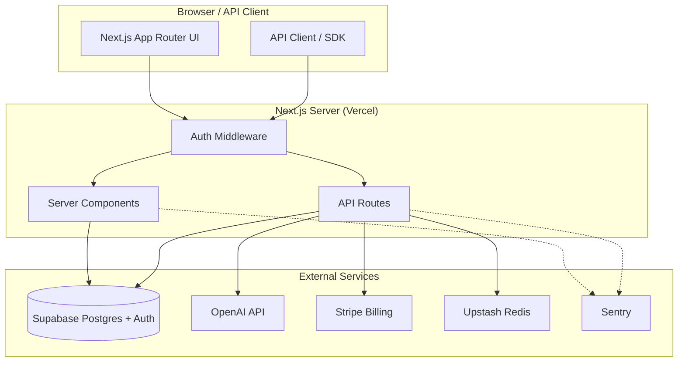

# AgentDesk — Architecture

## Overview

AgentDesk is a multi-tenant SaaS application built on Next.js 14 with the App Router. Each organization is isolated at the database level using Supabase Row-Level Security.

## System Diagram



## Request Flow

### Dashboard Page Load
1. Browser hits `GET /dashboard`
2. Middleware refreshes Supabase session from cookie
3. Server Component calls `supabase.auth.getUser()`
4. Server Component queries Supabase with RLS enforced
5. HTML streamed to browser

### Agent Execution
1. Client calls `POST /api/agents/:id/execute`
2. Middleware authenticates request
3. API route checks Upstash rate limit (10 req/min)
4. Validates monthly execution quota against org plan
5. Creates `agent_executions` record with status=running
6. Calls OpenAI with retry logic (3 attempts, exponential backoff)
7. Updates execution record with result
8. Fires webhooks for `execution.complete` event
9. Returns execution result

### Stripe Webhook
1. Stripe calls `POST /api/billing/webhook`
2. Route verifies `stripe-signature` header with `constructEvent()`
3. Handles `checkout.session.completed`, `subscription.updated`, `subscription.deleted`
4. Updates `orgs.plan` in Supabase using service role key (bypasses RLS)

## Multi-Tenancy

All data is scoped by `org_id`. The `auth_user_org_ids()` PostgreSQL function returns the set of org IDs the current user belongs to. All RLS policies use this function.

```sql
create or replace function auth_user_org_ids()
returns setof uuid language sql security definer stable as $$
  select org_id from org_members where user_id = auth.uid();
$$;
```

## Rate Limiting

Using Upstash Redis with sliding window algorithm:
- **General API routes**: 100 requests per minute per IP
- **Agent executions**: 10 requests per minute per IP/user

## Data Flow for Billing

```
User clicks Upgrade
  → POST /api/billing/create-checkout
  → Stripe creates Checkout Session
  → User redirected to Stripe
  → Stripe calls POST /api/billing/webhook
  → org.plan updated in Supabase
  → User sees new plan limits
```